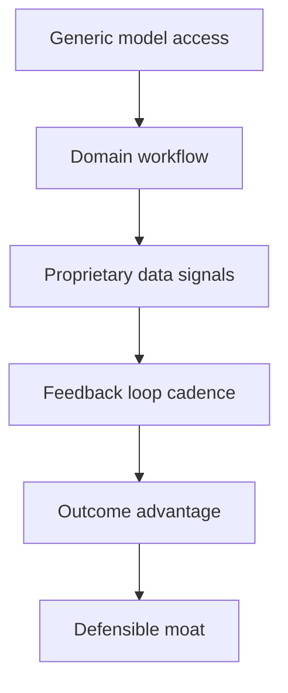

<!--
Primary keyword: AI-first SaaS moat
Search intent: informational
Secondary keywords: AI defensibility, AI SaaS pricing, outcome-based pricing, AI workflow moat, AI data advantage
FAQ targets: What makes an AI SaaS moat?, How do you price AI-first SaaS?, How do buyers evaluate AI defensibility?, What data advantages matter most?
-->

# AI-First SaaS: Moat, Defensibility, and Pricing Strategy

AI-first SaaS wins when it proves **compounding outcomes** and a workflow lock-in that competitors cannot replicate quickly. This guide shows how to build that moat and price around it.

## Table of contents

1. [Define your AI moat](#define-your-ai-moat)
2. [Defensibility checklist](#defensibility-checklist)
3. [Pricing models that work](#pricing-models-that-work)
4. [Examples: strong vs. weak AI moats](#examples-strong-vs-weak-ai-moats)
5. [Common mistakes](#common-mistakes)
6. [Action checklist](#action-checklist)
7. [Use the Smart Audit Tool for this](#use-the-smart-audit-tool-for-this)
8. [FAQs](#faqs)
9. [Sources & further reading](#sources--further-reading)
10. [Related reading](#related-reading)

## Define your AI moat

Moats are not just model access. They are built through **workflow integration, proprietary data, and feedback loops** that improve the system faster than competitors.

### For newer founders

  <h3 className="text-lg font-bold text-slate-900 mb-2 mt-0">For newer founders</h3>
  

    Pick one workflow where AI reduces time or increases revenue, then log the improvement. Buyers trust measurable deltas more than feature lists.
  

### For experienced founders

  <h3 className="text-lg font-bold text-slate-900 mb-2 mt-0">For experienced founders</h3>
  

    Invest in feedback loops and data rights. The fastest compounding advantage often comes from owning the signals your AI learns from.
  

## Defensibility checklist

- **Workflow embedding:** AI sits inside a daily workflow.
- **Data advantage:** proprietary or privileged data feeds the model.
- **Feedback loop cadence:** improvement measured weekly or monthly.
- **Switching costs:** outcomes decline if customers leave.
- **Cost discipline:** inference costs tracked and optimized.

## Pricing models that work

1. **Value-based pricing:** price by outcomes (savings or revenue lift).
2. **Usage-based with caps:** predictable ranges reduce friction.
3. **Hybrid tiers:** base subscription + AI usage add-on.

## Examples: strong vs. weak AI moats

### Example 1: Strong moat

- AI embedded in compliance workflows
- Proprietary data from audited records
- Outcome: 40% faster audits, 15% lower risk exposure

### Example 2: Weak moat

- Generic chatbot overlay on support tickets
- No proprietary data, no feedback loop
- Outcome: temporary lift, easily copied

## Common mistakes

1. **Treating model access as defensibility.**
2. **Ignoring inference cost creep.**
3. **Pricing without a clear value metric.**
4. **No documented AI performance benchmarks.**

## Action checklist

- [ ] Identify your proprietary data assets.
- [ ] Define a measurable AI outcome metric.
- [ ] Create a feedback loop roadmap.
- [ ] Pilot a value-based pricing tier.
- [ ] Document AI performance in your KPI pack.

## Use the Smart Audit Tool for this

Audit your AI moat messaging and pricing narrative before pitching.

**Run the Smart Audit Tool:** [Scan your AI narrative](/resources/tools-calculators/smart-audit)

Then anchor value with the **[free valuation calculator](/#free-valuation)**.

## FAQs

**What makes an AI SaaS moat?**
A defensible moat combines workflow embedding, proprietary data, and feedback loops that produce compounding outcomes.

**How do you price AI-first SaaS?**
Best practice is value-based or hybrid pricing that ties AI usage to outcomes while keeping cost predictability.

**How do buyers evaluate AI defensibility?**
They look for proprietary data, evidence of outcomes, and switching costs that increase over time.

## Sources & further reading

- Stanford AI Index: https://aiindex.stanford.edu/
- McKinsey – The state of AI: https://www.mckinsey.com/capabilities/quantumblack/our-insights
- Gartner – AI adoption insights: https://www.gartner.com/en/insights/artificial-intelligence
- Bessemer – State of the Cloud: https://www.bvp.com/cloud
- OpenView – SaaS benchmarks: https://openviewpartners.com/saas-benchmarks/
- SaaStr – AI in SaaS: https://www.saastr.com/

## Related reading

- [The future of SaaS with AI](/resources/the-future-of-saas-with-ai)
- [SaaS pricing strategies: value vs usage vs tiers](/resources/saas-pricing-strategies-value-vs-usage-vs-tiers)
- [SaaS valuation metrics buyers care about](/resources/saas-valuation-metrics-buyers-care-about)
