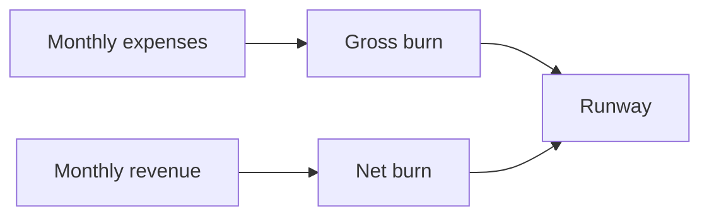

<!--
Primary keyword: burn rate and runway
Search intent: informational
Secondary keywords: startup runway calculator, net burn, gross burn, cash runway, SaaS cash flow
FAQ targets: How do I calculate runway?, What is a healthy burn rate?, What is net vs gross burn?, How much runway should a SaaS have?
-->

# Burn Rate and Runway: How Long You Have

Runway is the clock that dictates your options. This guide shows how to calculate burn rate, model scenarios, and make proactive decisions before the runway gets short.

## Table of contents

1. [Burn rate basics](#burn-rate-basics)
2. [How to calculate runway](#how-to-calculate-runway)
3. [Examples: two runway scenarios](#examples-two-runway-scenarios)
4. [Runway planning checklist](#runway-planning-checklist)
5. [Common mistakes](#common-mistakes)
6. [Use the Burn Rate Calculator for this](#use-the-burn-rate-calculator-for-this)
7. [FAQs](#faqs)
8. [Sources & further reading](#sources--further-reading)
9. [Related reading](#related-reading)

## Burn rate basics

- **Gross burn:** total monthly expenses.
- **Net burn:** expenses minus revenue.

### For newer founders

  <h3 className="text-lg font-bold text-slate-900 mb-2 mt-0">For newer founders</h3>
  

    If revenue is inconsistent, track net burn weekly. A 2–3 month surprise can end fundraising plans before they start.
  

### For experienced founders

  <h3 className="text-lg font-bold text-slate-900 mb-2 mt-0">For experienced founders</h3>
  

    Investors want to see a runway plan tied to milestones. If you cannot reach the next valuation step with current runway, adjust burn early.
  

## How to calculate runway

**Runway (months) = Cash balance ÷ Net burn**

## Examples: two runway scenarios

### Example 1: Bootstrapped SaaS

- Cash: $180k, Net burn: $15k/month
- Runway: **12 months**
- Decision: focus on retention to reduce burn

### Example 2: Venture-backed SaaS

- Cash: $2.4M, Net burn: $200k/month
- Runway: **12 months**
- Decision: raise now or cut burn to extend runway to 18 months

## Runway planning checklist

- [ ] Update cash balance weekly.
- [ ] Track net burn monthly.
- [ ] Model a 20% downside revenue scenario.
- [ ] Align runway with fundraising timeline.

## Common mistakes

1. **Ignoring net burn and tracking only gross burn.**
2. **Assuming revenue will stay flat.**
3. **Waiting too long to reduce burn.**
4. **Underestimating fundraising timelines.**

## Use the Burn Rate Calculator for this

**Run the Burn Rate & Runway Calculator:** [Calculate runway](/resources/tools-calculators/burn-rate-calculator)

## FAQs

**How do I calculate runway?**
Divide your cash balance by monthly net burn. That gives the number of months before you hit zero.

**What is a healthy burn rate?**
A healthy burn rate aligns with milestones and gives 12–18 months of runway in most SaaS contexts.

**What is net vs gross burn?**
Gross burn is total expenses; net burn subtracts revenue to show actual cash decline.

## Sources & further reading

- SaaS Capital – Benchmark data: https://www.saas-capital.com/saas-benchmarks/
- OpenView – SaaS metrics: https://openviewpartners.com/saas-benchmarks/
- Bessemer – State of the Cloud: https://www.bvp.com/cloud
- Y Combinator – Startup finance advice: https://www.ycombinator.com/library
- a16z – Financial planning: https://a16z.com/

## Related reading

- [Funding vs bootstrapping: what’s best for your stage](/resources/funding-vs-bootstrapping-what-best-for-your-stage)
- [LTV/CAC explained with examples](/resources/ltv-cac-explained-with-examples)
- [Prepare your SaaS for acquisition](/resources/prepare-your-saas-for-acquisition)
