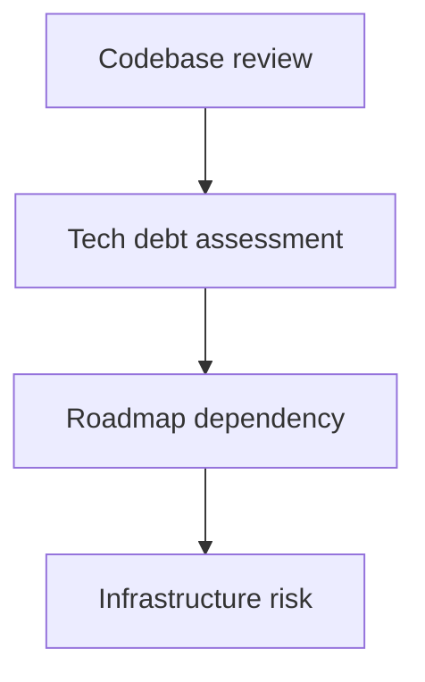

<!--
Primary keyword: due diligence checklist for SaaS buyers
Search intent: informational
Secondary keywords: SaaS acquisition diligence, M&A checklist, data room SaaS, buyer diligence steps, SaaS risk review
FAQ targets: What do SaaS buyers look for in diligence?, What documents are required for SaaS diligence?, How long does diligence take?, What are common red flags?
-->

# Due Diligence Checklist for SaaS Buyers

Diligence is where deals slow down. This checklist shows what buyers ask for and how to organize evidence so you avoid last-minute retrades.

## Table of contents

1. [Financial diligence](#financial-diligence)
2. [Product and engineering diligence](#product-and-engineering-diligence)
3. [Customer and retention diligence](#customer-and-retention-diligence)
4. [Security and compliance diligence](#security-and-compliance-diligence)
5. [Examples: smooth vs rough diligence](#examples-smooth-vs-rough-diligence)
6. [Action checklist](#action-checklist)
7. [Use the Smart Audit Tool for this](#use-the-smart-audit-tool-for-this)
8. [FAQs](#faqs)
9. [Sources & further reading](#sources--further-reading)
10. [Related reading](#related-reading)

## Financial diligence

- ARR/MRR bridge by month
- Churn and NRR by cohort
- Gross margin and unit economics
- Revenue concentration analysis

## Product and engineering diligence

- Architecture overview
- Roadmap dependencies
- Incident history

## Customer and retention diligence

- Top 20 customers and contract terms
- Churn by segment
- Pipeline quality

## Security and compliance diligence

- SOC 2 or equivalent
- Data handling policies
- Security incident history

### For newer founders

  <h3 className="text-lg font-bold text-slate-900 mb-2 mt-0">For newer founders</h3>
  

    Start a data room early. Even a simple folder with monthly KPIs, contracts, and security docs reduces diligence friction.
  

### For experienced founders

  <h3 className="text-lg font-bold text-slate-900 mb-2 mt-0">For experienced founders</h3>
  

    Buyers want proof that the business can run without you. Document leadership roles, handoffs, and operational playbooks.
  

## Examples: smooth vs rough diligence

### Example 1: Smooth diligence

- Clean ARR bridge and churn cohorts
- Security policies documented
- Close completed in 90 days

### Example 2: Rough diligence

- Revenue reconciliation issues
- Missing customer contracts
- Retrade on price and delayed close

## Action checklist

- [ ] Prepare a monthly ARR bridge.
- [ ] Document churn definitions and cohorts.
- [ ] Build a security and compliance folder.
- [ ] Inventory contracts and SLAs.
- [ ] Assign owners for diligence Q&A.

## Use the Smart Audit Tool for this

Scan your diligence narrative for red flags before buyers do.

**Run the Smart Audit Tool:** [Audit your data room narrative](/resources/tools-calculators/smart-audit)

Pair with the **[Risk Assessment Tool](/resources/tools-calculators/risk-assessment)** for red-flag scoring.

## FAQs

**What do SaaS buyers look for in diligence?**
They focus on revenue quality, retention, customer concentration, and operational risk.

**What documents are required?**
Financial statements, ARR bridges, churn cohorts, contracts, security policies, and product documentation are standard.

**What are common red flags?**
Inconsistent metrics, high concentration, unresolved security issues, and founder dependency.

## Sources & further reading

- KPMG – Tech M&A insights: https://kpmg.com
- PwC – M&A readiness: https://www.pwc.com
- SaaS Capital – Benchmarks: https://www.saas-capital.com/saas-benchmarks/
- Bessemer – State of the Cloud: https://www.bvp.com/cloud
- SaaStr – M&A lessons: https://www.saastr.com/

## Related reading

- [Prepare your SaaS for acquisition](/resources/prepare-your-saas-for-acquisition)
- [Risk assessment for SaaS founders](/resources/risk-assessment-for-saas-founders-red-flags)
- [How to prepare financials for SaaS acquisition](/resources/how-to-prepare-financials-for-saas-acquisition)
