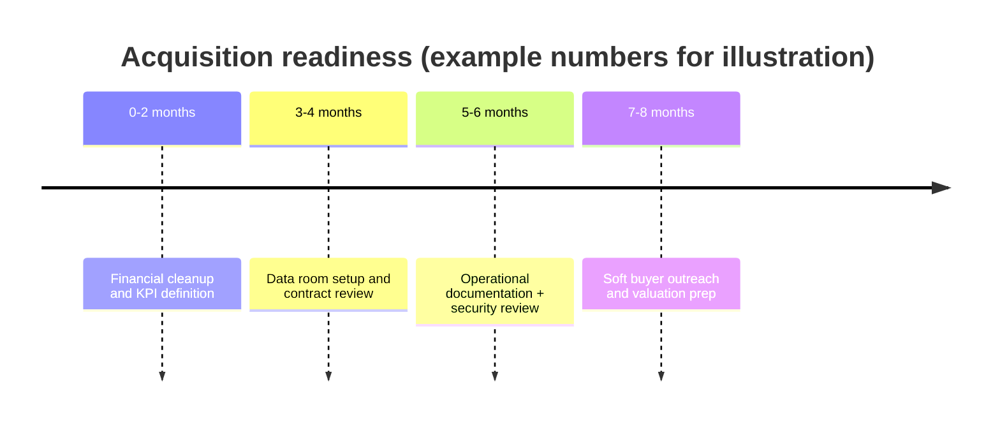

{/*
Primary keyword: prepare your SaaS for acquisition
Search intent: informational
Secondary keywords: SaaS acquisition checklist, due diligence preparation, sell SaaS business checklist, SaaS data room, financial cleanup for M&A, operational readiness, diligence red flags, SaaS buyer checklist, M&A prep timeline
FAQ targets: How do I prepare my SaaS for acquisition?, What documents do buyers ask for in SaaS due diligence?, How long does SaaS acquisition prep take?, What are common deal-killers in SaaS M&A?, How clean do financials need to be for a SaaS sale?, What is a data room for SaaS?
*/}

# How to Prepare Your SaaS for Acquisition (Operational + Financial Checklist)

The fastest way to lose a great offer is to look unprepared. Buyers expect a clean story, clean numbers, and evidence that the business runs without heroics. This guide gives you a practical, time-bound checklist that keeps diligence simple and protects your multiple.

## Table of contents

1. [The acquisition readiness timeline](#the-acquisition-readiness-timeline)
2. [Operational readiness checklist](#operational-readiness-checklist)
3. [Financial readiness checklist](#financial-readiness-checklist)
4. [Legal and security readiness](#legal-and-security-readiness)
5. [Case studies: what diligence found](#case-studies-what-diligence-found)
6. [Common mistakes](#common-mistakes)
7. [Action checklist](#action-checklist)
8. [Use the Smart Audit Tool for this](#use-the-smart-audit-tool-for-this)
9. [FAQs](#faqs)
10. [Sources & further reading](#sources--further-reading)
11. [Related reading](#related-reading)

## The acquisition readiness timeline

Most SaaS acquisitions take 3–6 months from first conversation to close, but **preparation** takes 6–12 months. Treat it like a product launch: clear milestones, owners, and a single source of truth.

### For newer founders

  <h3 className="text-lg font-bold text-slate-900 mb-2 mt-0">For newer founders</h3>
  
If you are under $1M ARR, you do not need a perfect data room. You do need clarity: a consistent chart of accounts, clean MRR logic, and documented churn math. Buyers will forgive gaps, but they won’t forgive confusion.

### For experienced founders

  <h3 className="text-lg font-bold text-slate-900 mb-2 mt-0">For experienced founders</h3>
  
If you have a team and multiple products, diligence expands quickly. Assign owners for finance, product, and security so that the deal doesn’t stall when the buyer asks for segmented reporting or cohort-level retention.

## Operational readiness checklist

Operational diligence focuses on whether the business can run without you and whether the product is maintainable.

**Core operational items:**

- Product roadmap with priorities, rationale, and owner
- Support process: ticketing, SLAs, escalation path
- Customer success playbooks for onboarding and renewals
- Org chart, roles, and key-person dependencies
- Incident response plan and uptime history
- Vendor list with renewal dates and contract terms

**Operational metrics to prep:**

- Product usage by cohort (activation and retention)
- Net revenue retention (NRR) and expansion drivers
- Support volume trends and resolution time

**Founder transition plan:** Buyers want to know the handoff is realistic. Draft a 30-60-90 day transition plan that lists your responsibilities, who will take ownership, and what documentation exists. Even a lightweight plan signals that you have already thought through continuity and lowers perceived risk.

**CTA:** If your documentation is thin, run a **[Smart Audit](/resources/tools-calculators/smart-audit)** on your pitch deck and support notes to catch operational gaps before a buyer does.

## Financial readiness checklist

Buyers will audit your revenue, margins, and cash conversion. They will also look for consistency between bank statements, billing data, and reported MRR.

**Financial checklist:**

- Accrual-basis P&L for the last 24–36 months
- Monthly MRR bridge (new, expansion, churn, contraction)
- Customer-level revenue exports (top 20 accounts)
- Gross margin by segment or product line
- CAC payback and LTV/CAC calculations
- Deferred revenue schedule if you bill annually
- Sales pipeline report (if enterprise)

**Tip:** If your reported ARR doesn’t reconcile to Stripe or QuickBooks, fix it now. That mismatch can stall a deal for weeks.

### Financial examples

- **Example A:** Buyer saw that 30% of revenue came from one reseller. Deal terms shifted to include a 12-month earnout.
- **Example B:** Company moved to accrual accounting and cleaned up deferred revenue. This removed a $150k discrepancy and accelerated LOI signing.

## Data room structure and owner assignments

A buyer’s first diligence request can easily exceed 100 items. A clean data room signals professionalism and reduces back-and-forth.

**Recommended data room folders:**

- Corporate: cap table, board minutes, entity docs
- Financials: P&L, balance sheet, cash flow, revenue bridge
- Customers: top accounts, contracts, renewal calendar
- Product: roadmap, architecture overview, dependencies
- Security: policies, audits, penetration tests, incident logs
- People: org chart, key roles, employment agreements
- Legal: IP assignments, vendor contracts, compliance docs

**Assign owners early:**

- Finance owner: reconciles revenue, produces monthly reporting
- Product/engineering owner: documents architecture and tech debt
- Customer success owner: builds renewal and churn narratives
- Security owner: centralizes policies and proof of controls

If you are a smaller team, one person can own multiple sections. The key is accountability and deadlines, so your response time during diligence is measured in hours, not weeks.

### Case study 3: The fast-close data room

- **Context:** $2.8M ARR SaaS with a two-person finance team.
- **Prep move:** Built a structured data room with a single index doc and updated it monthly.
- **Outcome:** Buyer completed diligence in 32 days with minimal follow-up and no retrade.
- **Lesson:** A clear data room can cut weeks off the timeline and reduce legal fees.

## Legal and security readiness

Legal and security diligence is increasingly standard, even for smaller deals.

- IP assignments for employees and contractors
- Key customer contracts and change-of-control clauses
- Privacy policy and data processing agreements
- SOC 2, ISO, or equivalent security posture (if needed)
- GDPR/CCPA compliance documentation for regulated customers

### CTA: De-risk the sale early

Use the **[Risk Assessment Tool](/resources/tools-calculators/risk-assessment)** to catalog red flags and prioritize the fixes that protect your valuation range.

## Pre-LOI positioning: the story buyers repeat internally

Before an LOI, buyers build an internal narrative to justify the deal. If your materials don’t help them tell that story, the process slows down or the price drops.

**What to prepare:**

- A one-page “why now” memo: market shift, product edge, and growth inflection
- A simple growth model showing how sales capacity or channel efficiency scales
- A churn narrative: top three churn causes and the fix in progress
- A tech roadmap summary: 3–4 bets that expand TAM or improve retention

**Why this matters:**

The decision maker is often presenting to a finance or risk committee. A clean narrative tied to metrics reduces friction and positions you as a low-risk integration. Make it easy for the buyer to explain to their CFO why the acquisition is defensible.
Include a simple “before and after” chart that shows how churn or margins improved during your prep window.
Keep the memo to one page.

## Case studies: what diligence found

### Case study 1: The messy MRR bridge

- **Context:** $1.4M ARR SaaS, SMB-heavy.
- **Diligence finding:** MRR calculation double-counted annual prepayments.
- **Outcome:** Buyer reduced the multiple and required a 60-day revenue verification period.
- **Lesson:** A clean MRR bridge is more valuable than a pretty deck.

### Case study 2: The operational key-person risk

- **Context:** $3.2M ARR SaaS, founder-led sales.
- **Diligence finding:** No documented sales playbook and no backup for founder-led renewals.
- **Outcome:** Buyer added a retention holdback and demanded a 12-month founder transition.
- **Lesson:** Documenting sales and renewal processes can protect both your valuation and your time.

## Common mistakes

1. **Treating diligence as an afterthought.** The prep work often takes longer than the sale itself.
2. **Ignoring customer concentration.** Buyers price this risk aggressively.
3. **Overlooking security posture.** Even a basic security review can uncover deal-stopping gaps.
4. **Failing to reconcile revenue.** If your numbers change between calls, trust evaporates.

## Action checklist

- [ ] Move to accrual accounting and reconcile to billing systems.
- [ ] Build a monthly MRR bridge (new, expansion, churn, contraction).
- [ ] Document onboarding, support, and renewal processes.
- [ ] Inventory contracts and confirm change-of-control clauses.
- [ ] Create a data room with a folder per diligence area.
- [ ] Run a red-flag scan on your deck and financial notes.

## Use the Smart Audit Tool for this

The **[Smart Audit Tool](/resources/tools-calculators/smart-audit)** is a fast way to scan your narrative for diligence red flags.

**Inputs to use:**
- Paste your P&L commentary, pitch deck, or internal monthly update
- Include the top 5 customer risks, top 3 churn reasons, and any unresolved security items

**Example scenario (illustrative):**
- Text includes “top customer is 18% of ARR” and “support backlog rising”
- Tool flags concentration risk and support capacity risk, suggesting mitigations and documentation needs

**How to interpret the output:**
- Use flagged items as your first 30-day remediation list.
- If multiple risks cluster in one area (ex: churn + support), build a focused project to show measurable improvement before you go to market.

  <h3 className="text-lg font-bold text-slate-900 mb-2 mt-0">Fast shortcut</h3>
  
Paste your deck into Smart Audit and fix the top three warnings before you meet a buyer.

  <a href="/resources/tools-calculators/smart-audit" className="text-teal-700 font-semibold">Run the Smart Audit →</a>

## FAQs

**How do I prepare my SaaS for acquisition?**
Start with clean financials and a clear MRR bridge, then document operations so the business can run without you.

**What documents do buyers ask for in SaaS due diligence?**
P&L statements, customer lists, contracts, revenue reconciliation, security policies, and product documentation.

**How long does SaaS acquisition prep take?**
Expect 6–12 months for a full cleanup, depending on how organized your finance and operations already are.

**What are common deal-killers?**
Unreconciled revenue, undocumented IP, security gaps, and high customer concentration.

**How clean do financials need to be?**
Clean enough that reported ARR matches your billing system and bank statements without manual adjustments.

## Sources & further reading

- KPMG – Global Tech M&A
- SaaS Capital – SaaS Benchmarks
- OpenView – SaaS Benchmarks
- Bessemer Venture Partners – State of the Cloud
- SaaStr – SaaS Metrics Library
- Nasdaq Cloud Index

## Related reading

- [When to sell your SaaS company](/resources/when-to-sell-your-saas-company)
- [SaaS valuation metrics buyers care about](/resources/saas-valuation-metrics-buyers-care-about)
- [Exit strategy roadmap](/resources/exit-strategy)
