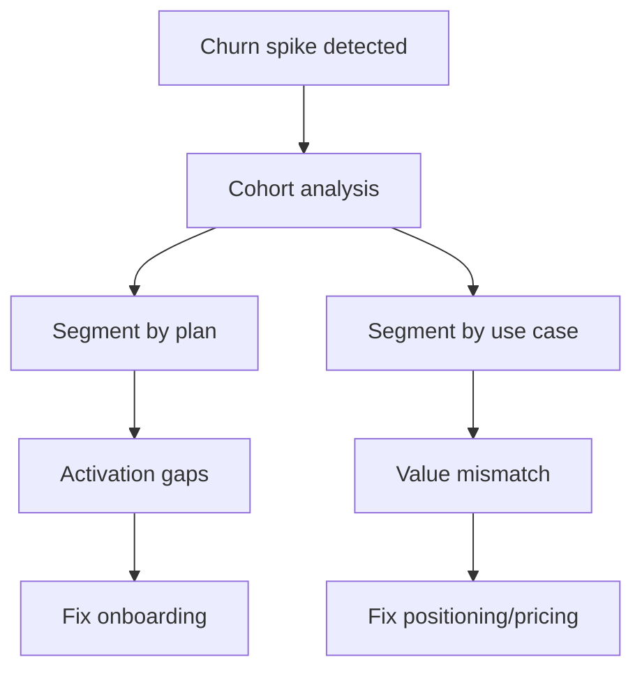

<!--
Primary keyword: reducing churn playbook
Search intent: informational
Secondary keywords: SaaS churn reduction, retention playbook, churn diagnostics, cohort analysis, net revenue retention
FAQ targets: How do I reduce SaaS churn?, What are the top churn drivers?, How do I analyze churn by cohort?, What experiments lower churn fastest?
-->

# Reducing Churn: A Practical SaaS Playbook

Churn is rarely a single problem. It is a chain of unmet expectations, weak activation, and unclear value. This playbook shows how to diagnose churn, prioritize fixes, and turn retention into a compounding growth lever.

## Table of contents

1. [Diagnose churn with cohorts](#diagnose-churn-with-cohorts)
2. [Find your top three churn drivers](#find-your-top-three-churn-drivers)
3. [Retention experiments that work](#retention-experiments-that-work)
4. [Examples: two churn turnarounds](#examples-two-churn-turnarounds)
5. [Common mistakes](#common-mistakes)
6. [Action checklist](#action-checklist)
7. [Use the Churn Calculator for this](#use-the-churn-calculator-for-this)
8. [FAQs](#faqs)
9. [Sources & further reading](#sources--further-reading)
10. [Related reading](#related-reading)

## Diagnose churn with cohorts

Start with **logo churn** and **revenue churn** by cohort, then separate by plan, segment, and activation milestone.

### For newer founders

  <h3 className="text-lg font-bold text-slate-900 mb-2 mt-0">For newer founders</h3>
  

    If you lack cohort data, start with simple cancellation surveys and a weekly churn review. Even a 10-response sample will surface the top two drivers.
  

### For experienced founders

  <h3 className="text-lg font-bold text-slate-900 mb-2 mt-0">For experienced founders</h3>
  

    Prioritize revenue churn by segment. If enterprise churn is flat but SMB churn is rising, your product may be over-delivering for SMB and under-serving mid-market.
  

## Find your top three churn drivers

1. **Activation failure:** users never reach the “aha” moment.
2. **Value mismatch:** the product solves the wrong problem for the segment.
3. **Price pressure:** value is clear, but price is not aligned to ROI.

## Retention experiments that work

- Re-sequence onboarding to hit the “aha” moment in week one.
- Add usage-triggered success outreach for low-activity accounts.
- Offer annual upgrades after a measurable outcome milestone.

## Examples: two churn turnarounds

### Example 1: Workflow SaaS

- Churn: 6% monthly, driven by weak activation
- Fix: shorter onboarding + in-app guidance
- Result: churn fell to 3.2% in 8 weeks

### Example 2: Analytics SaaS

- Churn: 4% monthly, driven by price sensitivity
- Fix: usage-based add-on + outcome proof
- Result: churn fell to 2.5% and NRR improved to 108%

## Common mistakes

1. **Treating churn as a sales problem only.**
2. **Ignoring the first 30 days of usage.**
3. **Measuring churn without segment context.**
4. **Overreacting to one noisy cohort.**

## Action checklist

- [ ] Build a churn dashboard by cohort and plan.
- [ ] Interview 10 churned customers.
- [ ] Identify the top two activation steps.
- [ ] Run a 4-week retention experiment.
- [ ] Track churn impact weekly.

## Use the Churn Calculator for this

Calculate churn impact and tie it to valuation outcomes.

**Run the Churn Calculator:** [Estimate retention impact](/resources/tools-calculators/churn-calculator)

For unit economics context, use the **[LTV/CAC Calculator](/resources/tools-calculators/ltv-cac-calculator)**.

## FAQs

**How do I reduce SaaS churn?**
Diagnose churn by cohort and segment, then run targeted activation and success experiments tied to measurable outcomes.

**What are the top churn drivers?**
Activation failure, value mismatch, and pricing misalignment are the most common drivers.

**How do I analyze churn by cohort?**
Group customers by start month and segment, then track logo and revenue churn over time.

## Sources & further reading

- SaaS Capital – Retention benchmarks: https://www.saas-capital.com/saas-benchmarks/
- OpenView – SaaS benchmarks: https://openviewpartners.com/saas-benchmarks/
- Bessemer – State of the Cloud: https://www.bvp.com/cloud
- Reforge – Retention essays: https://www.reforge.com/blog
- SaaStr – Customer success: https://www.saastr.com/

## Related reading

- [SaaS onboarding that improves retention](/resources/saas-onboarding-that-improves-retention)
- [LTV/CAC explained with examples](/resources/ltv-cac-explained-with-examples)
- [SaaS valuation metrics buyers care about](/resources/saas-valuation-metrics-buyers-care-about)
