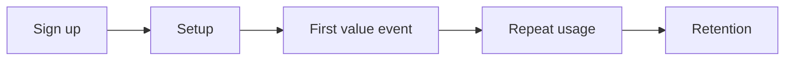

{/*
Primary keyword: SaaS onboarding that improves retention
Search intent: informational
Secondary keywords: onboarding best practices, activation milestones, retention onboarding, onboarding flow SaaS, product-led onboarding
FAQ targets: What is good SaaS onboarding?, How do you improve activation?, What onboarding metrics matter?, How do I reduce churn in the first 30 days?
*/}

# SaaS Onboarding That Improves Retention

Onboarding is the highest-leverage retention lever. The goal is not to show features—it is to deliver the first measurable outcome fast enough that customers stick.

## Table of contents

1. [Define the activation milestone](#define-the-activation-milestone)
2. [Build onboarding around outcomes](#build-onboarding-around-outcomes)
3. [Examples: onboarding flows that work](#examples-onboarding-flows-that-work)
4. [Common mistakes](#common-mistakes)
5. [Action checklist](#action-checklist)
6. [Use the Churn Calculator for this](#use-the-churn-calculator-for-this)
7. [FAQs](#faqs)
8. [Sources & further reading](#sources--further-reading)
9. [Related reading](#related-reading)

## Define the activation milestone

Activation is the moment a customer experiences **measurable value**. Define it as a number, not a feeling.

### For newer founders

  <h3 className="text-lg font-bold text-slate-900 mb-2 mt-0">For newer founders</h3>
  

    Pick one success metric. Example: “first report delivered” or “first 3 users invited.” Keep the onboarding flow focused on that single outcome.
  

### For experienced founders

  <h3 className="text-lg font-bold text-slate-900 mb-2 mt-0">For experienced founders</h3>
  

    Build segment-specific onboarding. The activation path for SMB should be shorter than enterprise. If both follow the same flow, one will churn.
  

## Build onboarding around outcomes

- Reduce steps to reach the first value event.
- Use in-app checklists to reinforce progress.
- Trigger human support when usage drops.

## Examples: onboarding flows that work

### Example 1: PLG analytics tool

- Activation: “first dashboard shared”
- Change: removed 4 setup steps and added templates
- Result: activation rose 22%, churn dropped 1.5 points

### Example 2: Workflow SaaS for ops teams

- Activation: “first workflow automated”
- Change: guided setup + concierge kickoff
- Result: 30-day retention increased from 68% to 80%

## Common mistakes

1. **Overloading onboarding with feature tours.**
2. **Not defining activation in measurable terms.**
3. **Ignoring usage drop signals.**
4. **Treating onboarding as a one-time event.**

## Action checklist

- [ ] Define the activation milestone and time-to-value goal.
- [ ] Remove non-essential setup steps.
- [ ] Add in-app progress cues.
- [ ] Trigger success outreach on low activity.
- [ ] Review onboarding weekly with data.

## Use the Churn Calculator for this

Quantify the retention value of onboarding changes.

**Run the Churn Calculator:** [Measure churn impact](/resources/tools-calculators/churn-calculator)

Pair with the **[LTV/CAC Calculator](/resources/tools-calculators/ltv-cac-calculator)** to show unit-economics lift.

## FAQs

**What is good SaaS onboarding?**
Onboarding that delivers the first measurable outcome quickly and sets a habit loop for repeat usage.

**How do you improve activation?**
Define the activation milestone, remove friction, and guide users directly to the value event.

**What onboarding metrics matter?**
Time-to-value, activation rate, and retention at 30/60/90 days are the core metrics.

## Sources & further reading

- Reforge – Activation insights: https://www.reforge.com/blog
- OpenView – Product-led growth resources: https://openviewpartners.com/product-led-growth/
- SaaS Capital – Retention benchmarks: https://www.saas-capital.com/saas-benchmarks/
- Mixpanel – Product analytics benchmarks: https://mixpanel.com/benchmarks/
- SaaStr – Customer success: https://www.saastr.com/

## Related reading

- [Reducing churn playbook](/resources/reducing-churn-playbook)
- [LTV/CAC explained with examples](/resources/ltv-cac-explained-with-examples)
- [SaaS pricing strategies: value vs usage vs tiers](/resources/saas-pricing-strategies-value-vs-usage-vs-tiers)
