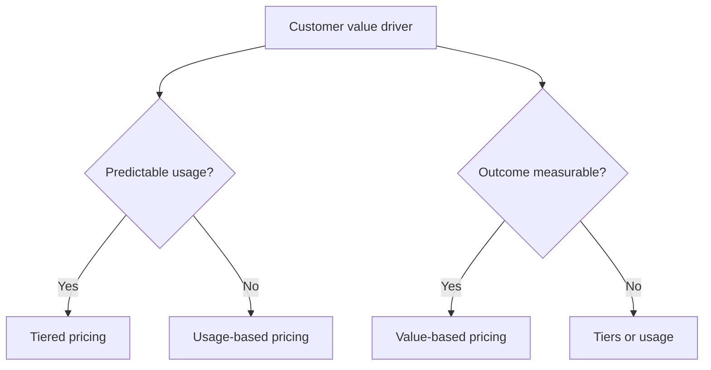

{/*
Primary keyword: SaaS pricing strategies
Search intent: informational
Secondary keywords: value-based pricing SaaS, usage-based pricing SaaS, tiered pricing model, pricing framework, SaaS monetization
FAQ targets: What is the best SaaS pricing model?, How do I choose between usage and tiers?, When should I use value-based pricing?, How does pricing affect LTV/CAC?
*/}

# SaaS Pricing Strategies: Value vs Usage vs Tiers

Pricing is a story about value, not just a billing mechanic. This guide compares three common pricing models and helps you choose the one that fits your product and customer behavior.

## Table of contents

1. [The three pricing models](#the-three-pricing-models)
2. [Decision framework](#decision-framework)
3. [Examples: which model wins](#examples-which-model-wins)
4. [Common mistakes](#common-mistakes)
5. [Action checklist](#action-checklist)
6. [Use the LTV/CAC Calculator for this](#use-the-ltvcac-calculator-for-this)
7. [FAQs](#faqs)
8. [Sources & further reading](#sources--further-reading)
9. [Related reading](#related-reading)

## The three pricing models

- **Value-based pricing:** price tied to outcomes.
- **Usage-based pricing:** price scales with consumption.
- **Tiered pricing:** fixed bundles for clarity and simplicity.

### For newer founders

  <h3 className="text-lg font-bold text-slate-900 mb-2 mt-0">For newer founders</h3>
  

    Start with tiers unless your product has a clear usage metric. Tiers reduce decision friction and make it easier to test pricing changes.
  

### For experienced founders

  <h3 className="text-lg font-bold text-slate-900 mb-2 mt-0">For experienced founders</h3>
  

    If you can measure outcomes, value-based pricing often unlocks a higher willingness to pay, but requires strong ROI proof and customer success support.
  

## Decision framework

Ask:

1. Is usage predictable and easy to measure?
2. Do customers tie spend to ROI?
3. Is billing simplicity critical for adoption?

## Examples: which model wins

### Example 1: Dev tooling platform

- Usage varies wildly by team size
- Best fit: usage-based with spend caps

### Example 2: HR workflow SaaS

- Outcome: time saved per hire
- Best fit: value-based + tiered bundles

## Common mistakes

1. **Pricing without a usage metric.**
2. **Adding too many tiers too early.**
3. **Hiding usage fees that surprise buyers.**
4. **Ignoring LTV/CAC impact.**

## Action checklist

- [ ] Identify your primary value metric.
- [ ] Map usage variability by segment.
- [ ] Test one pricing model change per quarter.
- [ ] Track churn and expansion after changes.

## Use the LTV/CAC Calculator for this

Pricing changes must improve unit economics.

**Run the LTV/CAC Calculator:** [Calculate unit economics](/resources/tools-calculators/ltv-cac-calculator)

## FAQs

**What is the best SaaS pricing model?**
There is no single best model. Choose based on usage predictability, outcome measurability, and buyer preference for simplicity.

**How do I choose between usage and tiers?**
If usage is predictable and easy to understand, tiers work well. If usage drives value and varies by customer, usage-based pricing fits better.

**When should I use value-based pricing?**
Use value-based pricing when you can prove outcomes and link them directly to ROI.

## Sources & further reading

- OpenView – Pricing research: https://openviewpartners.com/insights/
- ProfitWell – Pricing strategies: https://www.profitwell.com/resources
- Bessemer – State of the Cloud: https://www.bvp.com/cloud
- SaaS Capital – SaaS benchmarks: https://www.saas-capital.com/saas-benchmarks/
- SaaStr – Monetization playbooks: https://www.saastr.com/

## Related reading

- [LTV/CAC explained with examples](/resources/ltv-cac-explained-with-examples)
- [Reducing churn playbook](/resources/reducing-churn-playbook)
- [AI-first SaaS: moat, defensibility, and pricing](/resources/ai-first-saas-moat-defensibility-and-pricing)
