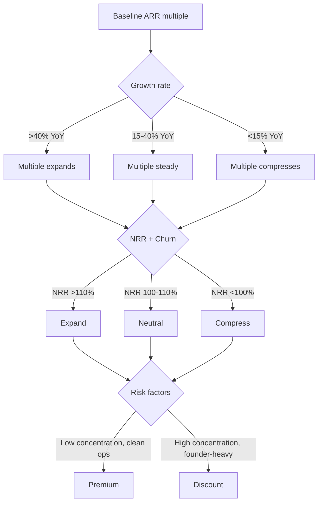

<!--
Primary keyword: typical SaaS valuation multiples
Search intent: informational
Secondary keywords: SaaS ARR multiples, valuation drivers, revenue multiple ranges, SaaS comps, valuation risk factors, multiple expansion, multiple compression
FAQ targets: What is a typical SaaS valuation multiple?, How do growth and retention affect SaaS multiples?, What reduces a SaaS multiple?, How do buyers set a SaaS multiple?, Are multiples higher for AI SaaS?
-->

# Typical SaaS Valuation Multiples (and What Moves Them)

Multiples are not a magic number. They are a shorthand for risk, durability, and velocity. This guide shows the **common ranges** buyers use, then breaks down the drivers that move your multiple up or down so you can explain and defend the range.

## Table of contents

1. [The baseline multiple bands](#the-baseline-multiple-bands)
2. [The five drivers that move multiples](#the-five-drivers-that-move-multiples)
3. [Examples: same ARR, different multiples](#examples-same-arr-different-multiples)
4. [Deal context: strategic vs. financial buyers](#deal-context-strategic-vs-financial-buyers)
5. [Common mistakes](#common-mistakes)
6. [Action checklist](#action-checklist)
7. [Use the Free Valuation Calculator for this](#use-the-free-valuation-calculator-for-this)
8. [FAQs](#faqs)
9. [Sources & further reading](#sources--further-reading)
10. [Related reading](#related-reading)

## The baseline multiple bands

Most buyers start from a **baseline ARR multiple** and then adjust for growth, retention, margin, and risk. The ranges below are directional — they move with market cycles.

- **Early-stage (sub-$2M ARR):** 2x–5x ARR
- **Growth-stage ($2M–$10M ARR):** 4x–8x ARR
- **Scale-stage ($10M+ ARR):** 6x–12x ARR

The point is not the exact number. The point is how your **risk profile** pulls the range up or down.

### For newer founders

  <h3 className="text-lg font-bold text-slate-900 mb-2 mt-0">For newer founders</h3>
  

    If you are under $1M ARR, the multiple is often more sensitive to founder dependency and churn. A clean data room and stable retention can add a full turn to your range even before you scale revenue.
  

### For experienced founders

  <h3 className="text-lg font-bold text-slate-900 mb-2 mt-0">For experienced founders</h3>
  

    Buyers will treat your multiple as a negotiation anchor. If you can show a repeatable growth engine and a post-close leadership bench, you can justify an extra turn even in a tight market.
  

## The five drivers that move multiples

1. **Growth rate.** Strong YoY growth signals demand and can add 1–3 turns to the multiple.
2. **Retention quality.** Net revenue retention (NRR) above 110% is a premium trigger.
3. **Gross margin.** Margins above 75% signal scalability and durability.
4. **Revenue concentration.** If a top customer is >15% of ARR, multiples compress.
5. **Operational risk.** Founder dependency, tech debt, and weak reporting all reduce trust.

## Examples: same ARR, different multiples

### Example 1: $3M ARR with strong retention

- 48% YoY growth, 118% NRR, 78% gross margin
- Multiple range: **7x–9x ARR**
- Why: high retention + predictable expansion supports premium pricing

### Example 2: $3M ARR with churn risk

- 30% YoY growth, 94% NRR, top customer = 18% of ARR
- Multiple range: **4x–6x ARR**
- Why: churn + concentration compress the range even with similar growth

## Deal context: strategic vs. financial buyers

Strategic buyers may pay above-market if your product unlocks a roadmap gap or adds distribution. Financial buyers are more formula-driven and focus on risk-adjusted durability.

## Common mistakes

1. **Using headline multiples without explaining drivers.**
2. **Ignoring retention quality when presenting ARR growth.**
3. **Assuming AI buzzwords add a premium without evidence.**
4. **Leaving concentration risk unaddressed until diligence.**

## Action checklist

- [ ] Benchmark your ARR band and growth rate.
- [ ] Document NRR, churn, and expansion mechanics.
- [ ] Quantify customer concentration risk.
- [ ] Prepare a margin story with hosting and services separated.
- [ ] Build a one-page valuation narrative for buyers.

## Use the Free Valuation Calculator for this

Start with a baseline range, then layer in drivers like churn and growth.

**Run the free valuation calculator:** [Get a baseline valuation range](/#free-valuation)

Want to stress test retention impact? Pair it with the **[Churn Calculator](/resources/tools-calculators/churn-calculator)**.

## FAQs

**What is a typical SaaS valuation multiple?**
Most SaaS deals start from a revenue multiple tied to ARR size, growth, and retention. Early-stage ranges are often 2x–5x ARR, while scale-stage companies can reach 6x–12x when metrics are strong.

**How do growth and retention affect SaaS multiples?**
Growth rate expands the range, and strong NRR sustains the premium. Weak retention compresses the multiple even with high growth.

**What reduces a SaaS multiple?**
High churn, customer concentration, founder dependency, and margin pressure all reduce the multiple.

## Sources & further reading

- SaaS Capital – SaaS Benchmark Report: https://www.saas-capital.com/saas-benchmarks/
- Bessemer Venture Partners – State of the Cloud: https://www.bvp.com/cloud
- OpenView – SaaS Benchmarks: https://openviewpartners.com/saas-benchmarks/
- KeyBanc Capital Markets – SaaS Survey: https://www.key.com/about/keybanc-capital-markets/index.html
- Nasdaq Cloud Index: https://www.nasdaq.com/market-activity/quotes/nasdaq-cnx
- SaaStr – SaaS Metrics Library: https://www.saastr.com/category/saas-metrics/

## Related reading

- [SaaS valuation metrics buyers care about](/resources/saas-valuation-metrics-buyers-care-about)
- [Prepare your SaaS for acquisition](/resources/prepare-your-saas-for-acquisition)
- [When to sell your SaaS company](/resources/when-to-sell-your-saas-company)
